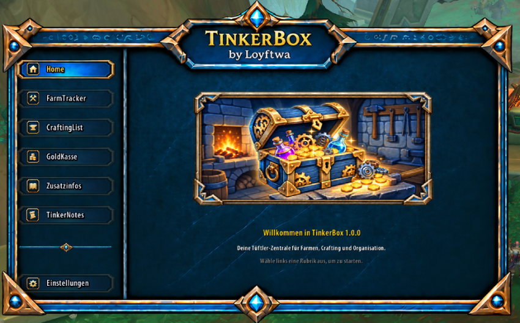
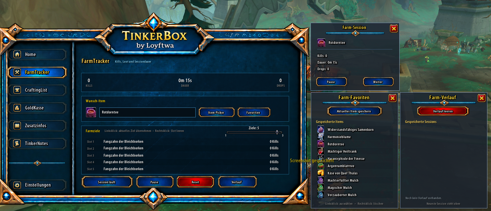
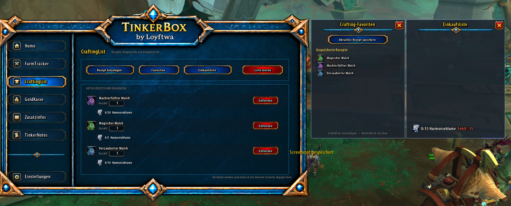
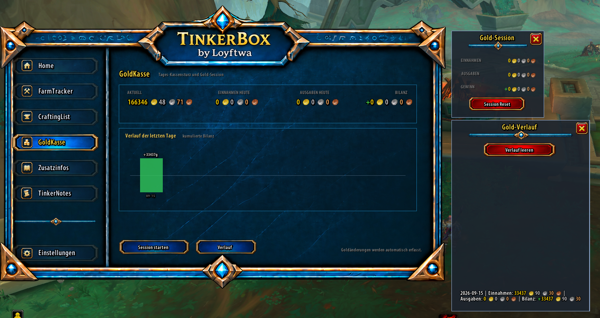
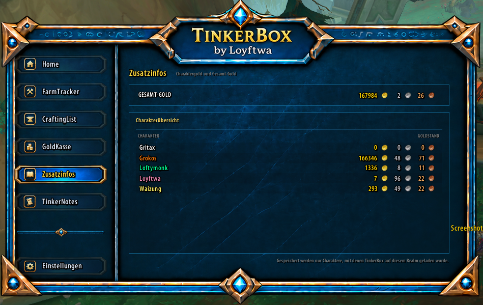
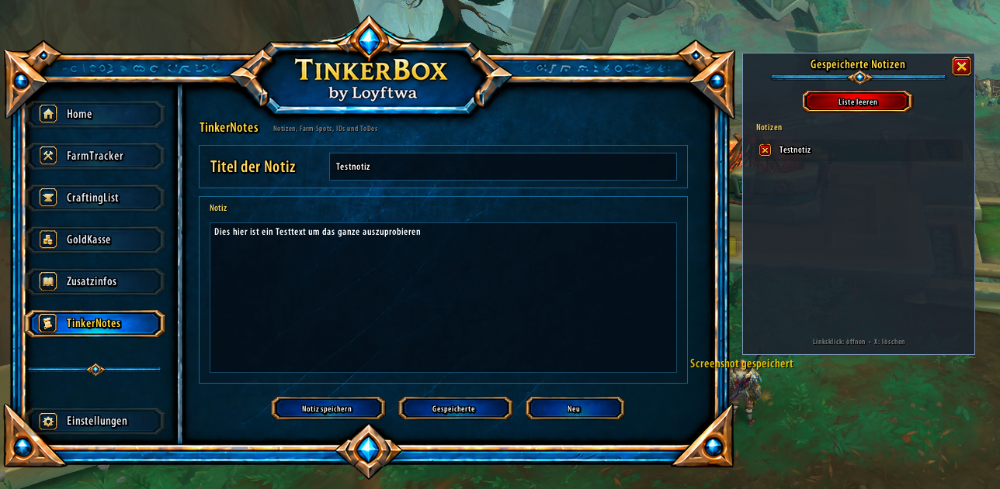
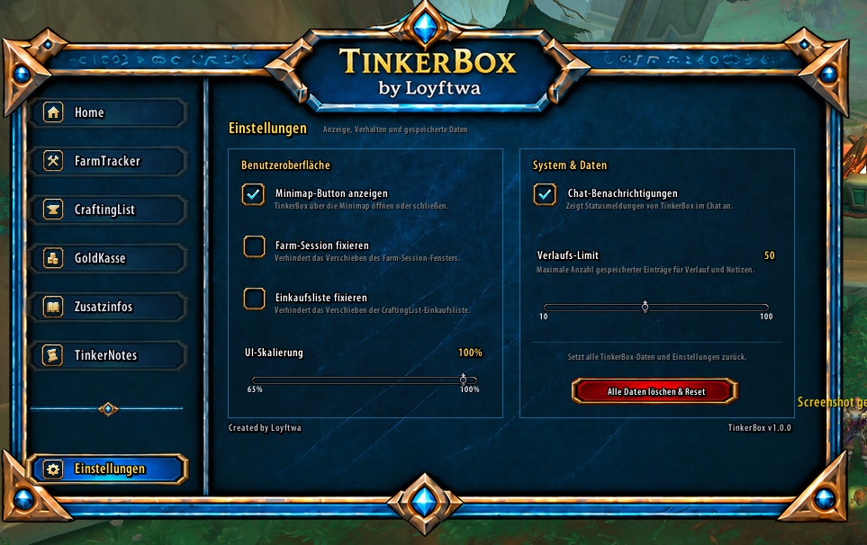

# TinkerBox

**TinkerBox** is a modular utility addon for **World of Warcraft Retail / Midnight**.

It combines farming, crafting, gold tracking and personal organization tools in one consistent interface.

## Screenshots

### Main Frame

| FarmTracker | CraftingList |
| --- | --- |
|  |  |

| GoldKasse | Zusatzinfos |
| --- | --- |
|  |  |

| TinkerNotes | Einstellungen |
| --- | --- |
|  |  |

## Features

- **FarmTracker**
  - Farming sessions
  - Kill and drop tracking
  - Target items
  - Favorites
  - History

- **CraftingList**
  - Add selected profession recipes
  - Track required materials
  - Set recipe quantities
  - Shopping list
  - Recipe favorites

- **GoldKasse**
  - Current gold
  - Daily income and expenses
  - Daily balance
  - Gold sessions
  - Gold history

- **Zusatzinfos**
  - Total gold
  - Character overview
  - Class-colored character names
  - Fixed gold / silver / copper columns

- **TinkerNotes**
  - Multiple notes
  - Titles and text content
  - Saved-notes overview
  - Open, delete and clear notes

- **Minimap Button**
  - Quick access to TinkerBox
  - Custom TinkerBox icon
  - Drag positioning
  - Tooltip

- **Settings**
  - Show / hide minimap button
  - Lock Farm Session window
  - Lock Crafting shopping list
  - UI scale
  - Chat notifications
  - History limit
  - Full data reset

## Installation

1. Download the latest release ZIP.
2. Extract it.
3. Copy the `TinkerBox` folder to:

   `World of Warcraft/_retail_/Interface/AddOns/`

4. Start World of Warcraft or use `/reload`.

## Version

Current release: **1.0.0**

## Author

Created by **Loyftwa**.

## CurseForge

TinkerBox is also intended to be distributed through CurseForge.
